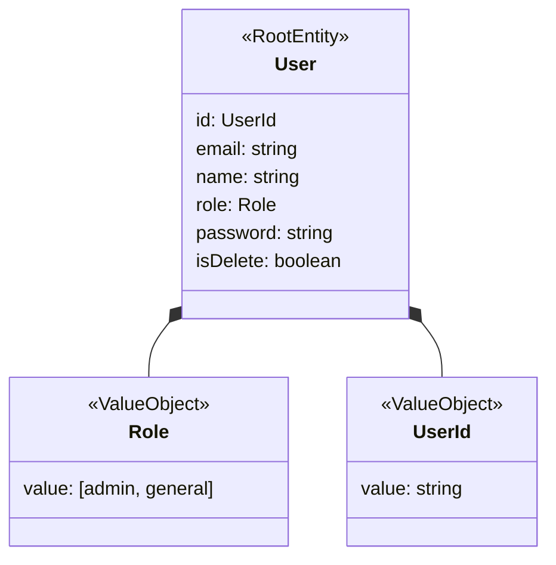
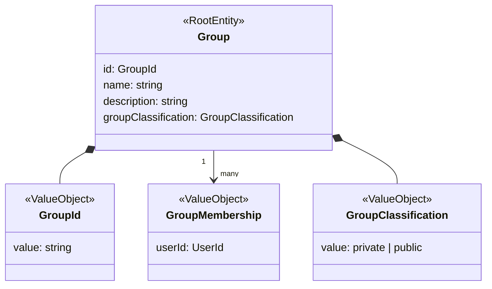
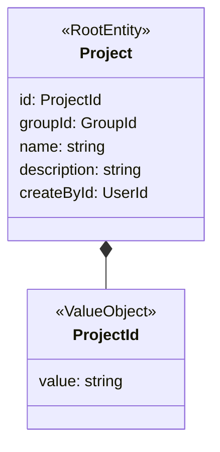
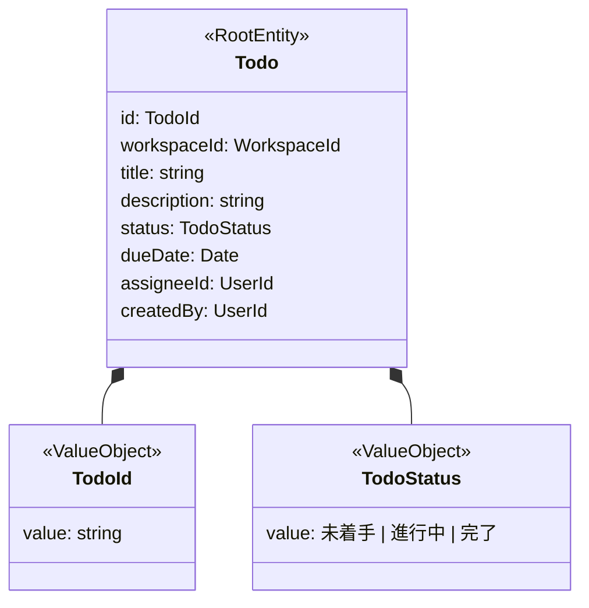

# ドメイン設計

## User Aggregate

### モデル図

### ドメインルール

| 属性     | 制約                                                | 必須 |
| -------- | --------------------------------------------------- | ---- |
| id       | UILD                                                | ✅   |
| email    | メールアドレス形式   最大文字数：50文字          | ✅   |
| name     | 最大文字数：30文字                                  | ✅   |
| role     | admin（管理者）, general（一般）                    | ✅   |
| password | 8文字以上16文字以下 保存形式はハッシュ化された値 | ✅   |
| isDelete | デフォルト値：false                                 | ✅   |

___

## Group Aggregate

| 属性                | 制約                             | 必須 |
| ------------------- | -------------------------------- | ---- |
| id                  | UILD                             | ✅   |
| name                | 最大文字数：30文字               | ✅   |
| description         | 最大文字数：80文字               | ✅   |
| groupClassification | admin（管理者）, general（一般） | ✅   |
| GroupMembership     | UILD                             | ✅   |

___

## Project Aggregate

| 属性        | 制約               | 必須 |
| ----------- | ------------------ | ---- |
| id          | UILD               | ✅   |
| groupId     | UILD               | ✅   |
| name        | 最大文字数：30文字 | ✅   |
| description | 最大文字数：80文字 | ✅   |
| createById  | UILD               | ✅   |

___

## Todo Aggregate

| 属性        | 制約                                                       | 必須 |
| ----------- | ---------------------------------------------------------- | ---- |
| id          | UILD                                                       | ✅   |
| workspaceId | UILD                                                       | ✅   |
| title       | 最大文字数：30文字                                         | ✅   |
| description | 最大文字数：80文字                                         | ✅   |
| status      | 未着手 (NotStarted) , 進行中(InProgress) , 完了(Completed) | ✅   |
| dueDate     |                                                            | ✅   |
| assigneeId  |                                                            | ✅   |
| createdBy   |                                                            | ✅   |