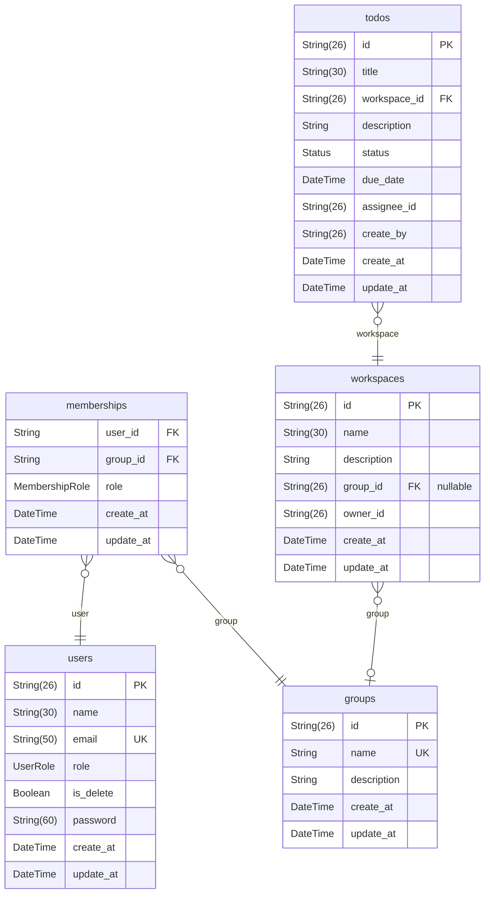

# ER図

> Generated by [`prisma-markdown`](https://github.com/samchon/prisma-markdown)

- [TODO](#todo)

## TODO

### `users`

Properties as follows:

- `id`: ユーザーID *(CHAR(26), NOT NULL)*
- `name`: ユーザー名 *(VARCHAR(30), NOT NULL)*
- `email`: メールアドレス *(VARCHAR(50), NOT NULL)*
- `role`: ユーザー管理権限 *(ENUM{amdin, member}), NOT NULL)*
- `is_delete`: 削除フラグ *(論理削除フラグ)*
- `password`: パスワード *(VARCHAR(30), NOT NULL)*
- `create_at`: 作成日 *(TIMESTAMP WITH TIME ZONE, NOT NULL)*
- `update_at`: 更新日 *(TIMESTAMP WITH TIME ZONE)*

### `groups`

Properties as follows:

- `id`: グループID *(CHAR(26))*
- `name`: グループ名 *(グループ名)*
- `description`: グループの説明 *(TEXT)*
- `create_at`: 作成日 *(TIMESTAMP WITH TIME ZONE, NOT NULL)*
- `update_at`: 更新日 *(TIMESTAMP WITH TIME ZONE)*

### `memberships`

Properties as follows:

- `user_id`: ユーザーID *(CHAR(26))*
- `group_id`: グループID *(CHAR(26))*
- `role`: ワークスペース権限 *(enum{admin, member})*
- `create_at`: 作成日 *(TIMESTAMP WITH TIME ZONE, NOT NULL)*
- `update_at`: 更新日 *(TIMESTAMP WITH TIME ZONE)*

### `workspaces`

Properties as follows:

- `id`: ワークスペースID *(CHAR(26))*
- `name`: ワークスペース名 *(VARCHAR(30))*
- `description`: ワークスペースの説明 *(TEXT)*
- `group_id`: グループID *(CHAR(26))*
- `owner_id`: 所有者のユーザーID *(CHAR(26))*
- `create_at`: 作成日 *(TIMESTAMP WITH TIME ZONE, NOT NULL)*
- `update_at`: 更新日 *(TIMESTAMP WITH TIME ZONE)*

### `todos`

Properties as follows:

- `id`: TODO ID *(CHAR(26))*
- `title`: TODOタイトル *(VARCHAR(30))*
- `workspace_id`: ワークスペースID *(CHAR(26))*
- `description`: TODOの説明 *(TEXT)*
- `status`: ステータス *(enum{NotStarted, InProgress, Completed})*
- `due_date`: 完了期限日 *(CHAR(26))*
- `assignee_id`: 担当者のユーザーID *(CHAR(26))*
- `create_by`: 作成者のユーザーID *(CHAR(26))*
- `create_at`: 作成日 *(TIMESTAMP WITH TIME ZONE, NOT NULL)*
- `update_at`: 更新日 *(TIMESTAMP WITH TIME ZONE)*
