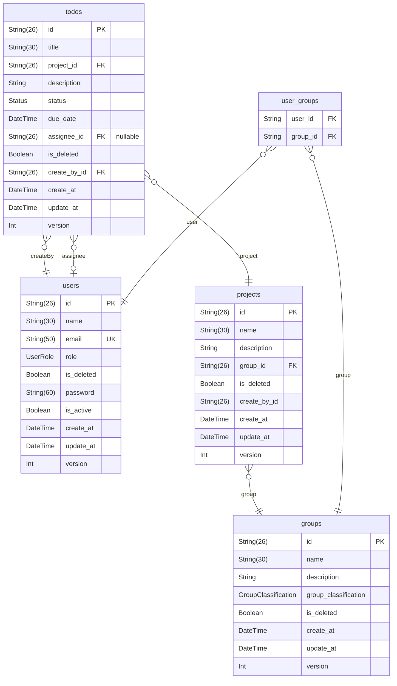

# ER図

> Generated by [`prisma-markdown`](https://github.com/samchon/prisma-markdown)

- [TODO](#todo)

## TODO

```mermaid
erDiagram
"users" {
  String(26) id PK
  String(30) name
  String(50) email UK
  UserRole role
  Boolean is_deleted
  String(60) password
  Boolean is_active
  DateTime create_at
  DateTime update_at
  Int version
}
"groups" {
  String(26) id PK
  String(30) name
  String description
  GroupClassification group_classification
  Boolean is_deleted
  DateTime create_at
  DateTime update_at
  Int version
}
"user_groups" {
  String user_id FK
  String group_id FK
}
"projects" {
  String(26) id PK
  String(30) name
  String description
  String(26) group_id FK
  Boolean is_deleted
  String(26) create_by_id
  DateTime create_at
  DateTime update_at
  Int version
}
"todos" {
  String(26) id PK
  String(30) title
  String(26) project_id FK
  String description
  Status status
  DateTime due_date
  String(26) assignee_id FK "nullable"
  Boolean is_deleted
  String(26) create_by_id FK
  DateTime create_at
  DateTime update_at
  Int version
}
"user_groups" }o--|| "users" : user
"user_groups" }o--|| "groups" : group
"projects" }o--|| "groups" : group
"todos" }o--|| "projects" : project
"todos" }o--o| "users" : assignee
"todos" }o--|| "users" : createBy
```

### `users`

Properties as follows:

- `id`: ユーザーID *(CHAR(26), NOT NULL)*
- `name`: ユーザー名 *(VARCHAR(30), NOT NULL)*
- `email`: メールアドレス *(VARCHAR(50), NOT NULL)*
- `role`: ユーザー管理権限 *(ENUM{amdin, member}), NOT NULL)*
- `is_deleted`: 削除フラグ *(BOOLEAN, NOT NULL)*
- `password`: パスワード *(VARCHAR(30), NOT NULL)*
- `is_active`: アクティブ状態 *(BOOLEAN, NOT NULL)*
- `create_at`: 作成日 *(TIMESTAMP WITH TIME ZONE, NOT NULL)*
- `update_at`: 更新日 *(TIMESTAMP WITH TIME ZONE)*
- `version`: 排他制御バージョン *(INT)*

### `groups`

Properties as follows:

- `id`: グループID *(CHAR(26))*
- `name`: グループ名 *(グループ名)*
- `description`: グループの説明 *(TEXT)*
- `group_classification`: グループの種別 *(ENUM{private, public}), NOT NULL)*
- `is_deleted`: 削除フラグ *(BOOLEAN, NOT NULL)*
- `create_at`: 作成日 *(TIMESTAMP WITH TIME ZONE, NOT NULL)*
- `update_at`: 更新日 *(TIMESTAMP WITH TIME ZONE)*
- `version`: 排他制御バージョン *(INT)*

### `user_groups`

Properties as follows:

- `user_id`: ユーザーID *(CHAR(26))*
- `group_id`: グループID *(CHAR(26))*

### `projects`

Properties as follows:

- `id`: ワークスペースID *(CHAR(26))*
- `name`: ワークスペース名 *(VARCHAR(30))*
- `description`: ワークスペースの説明 *(TEXT)*
- `group_id`: グループID **(CHAR(26))*
- `is_deleted`: 削除フラグ *(BOOLEAN, NOT NULL)*
- `create_by_id`: 所有者のユーザーID *(CHAR(26))*
- `create_at`: 作成日 *(TIMESTAMP WITH TIME ZONE, NOT NULL)*
- `update_at`: 更新日 *(TIMESTAMP WITH TIME ZONE)*
- `version`: 排他制御バージョン *(INT)*

### `todos`

Properties as follows:

- `id`: TODO ID *(CHAR(26))*
- `title`: TODOタイトル *(VARCHAR(30))*
- `project_id`: プロジェクトID *(CHAR(26))*
- `description`: TODOの説明 *(TEXT)*
- `status`: ステータス *(enum{NotStarted, InProgress, Completed})*
- `due_date`: 完了期限日 *(CHAR(26))*
- `assignee_id`: 担当者のユーザーID *(CHAR(26))*
- `is_deleted`: 削除フラグ *(BOOLEAN, NOT NULL)*
- `create_by_id`: 作成者のユーザーID *(CHAR(26))*
- `create_at`: 作成日 *(TIMESTAMP WITH TIME ZONE, NOT NULL)*
- `update_at`: 更新日 *(TIMESTAMP WITH TIME ZONE)*
- `version`: 排他制御バージョン *(INT)*
